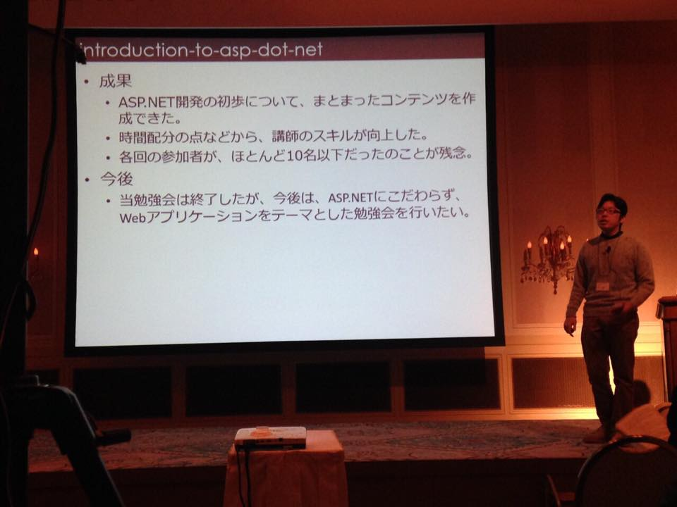

# ライトニングトーク会やります！

K1342 木村 憲規

---

## 概要

* 隔月(奇数月) の第4土曜日 17:00～19:00
* LTのテーマは自由

---

## LT会の目的

* プレゼンが上手くなりたい！
* みんなの話が聞きたい！
* いろんな話がしたい！

---

## プレゼンが上手くなりたい！

---

## どうやったらうまくなる？

* 場数踏めばうまくなるんじゃねーの

---

## みんなの話が聞きたい！

* 普段なにやってんの？
* どーいうスキル持ってんの？
* 得意分野の最新情報を教えて！

---

## いろんな話がしたい！

* JavaScript界隈の最新情報
* 個人プロジェクトの成果
* やきうの話
* 愚痴

---

## GitHub のレポジトリ

https://github.com/Kazunori-Kimura/kansai-lt

* ここに情報を集めていきたい
* 要望があれば GitHub Organization に移行します

---

## Facebookグループ

開催の案内はこちら -> 

ディスカッションはこちら -> 

---

## Slackチーム

* Slack: チャットツール
  - 関西LT: 
  - 参加はこちらから ->

herokuのアプリなので、眠ってる場合あります。
その場合は `F5` 押して再読み込み

---

## LTしてくれる人募集！

* お名前とLTのタイトルを連絡ください
  - テーマは何でもOK

---

## アイデア募集！

* こんな話が聞きたい！
* こういうことやりたい！

FacebookやSlackに投稿すると、誰かリアクションするかも

---

## 懇親会について

* LT会後に懇親会を実施予定です！
  - 参加費3,000円

---

## ありがとうございました！

http://kazunori-kimura.github.io/

* Twitter: @KazunoriJs
* Facebook: facebook.com/kazunori.kimura.311
* GitHub: https://github.com/Kazunori-Kimura
* Qiita: http://qiita.com/Kazunori-Kimura
