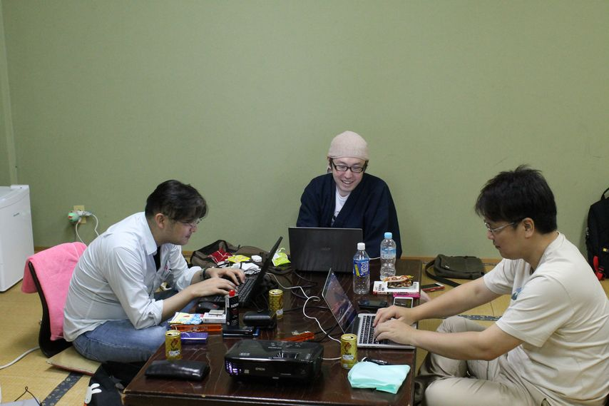
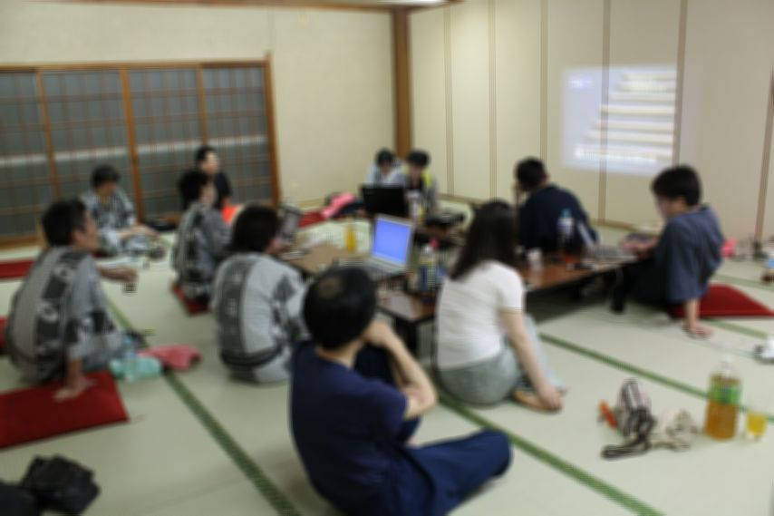
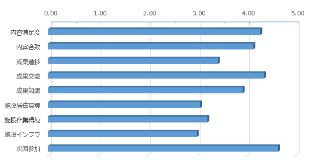

# 開発合宿を成功させる3つのポイント

K1342 木村 憲規

---

## 開発合宿を開催

7/1~3 に 三重県津市で開催

---

## 参加者の属性がバラバラ

* フリーランスの集まり
  - 会社等で開発合宿するのとはちょっと違う

---

## 成功のポイント

1. テーマ・課題の選定
2. 事前と合宿中の情報共有
3. 宿のチョイス

---

## 1. テーマ・課題の選定

* 今回、具体的なテーマや課題は選定しなかった
  - できなかった、という側面も
* タイムスケジュールや方向性はある程度定めておいた
  - その中で参加者に自由に楽しんでもらう

---

## 方向性

* 交流か、作業か
  - 今回は作業に重点を置いたつもり
  - 事前に方向性ははっきり伝えた方がよい

---

## 2. 事前と合宿中の情報共有

* 今回、Facebook と SharePoint で情報共有した
  - Facebook だと 事前、開催中、事後の繋がりが維持できて良い
  - SharePoint は情報を取りまとめるのに便利
* 事前の参加希望などはGoogleフォームを使用

---

## 事前

* アンケートで参加者の仕事内容や取り組みたい事について取りまとめ、共有する

---

## 合宿中

* 合宿の最初に事前アンケートを元に自己紹介する

---

## 3. 宿のチョイス

* 出来るだけ安い宿を探したが、あまり満足度が高くなかった
  - 設備の充実度、清潔感は、やはり値段に比例する
  - あまりに田舎だとインフラ面が課題に (今回、Wi-maxが入らなかった)

*教訓 - 宿泊費をケチるな*

---

概ね好評だったので、来年もやりたいな

