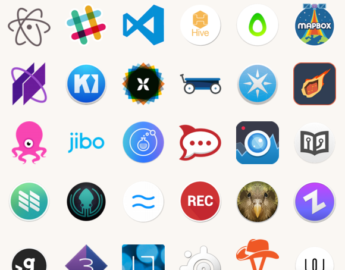
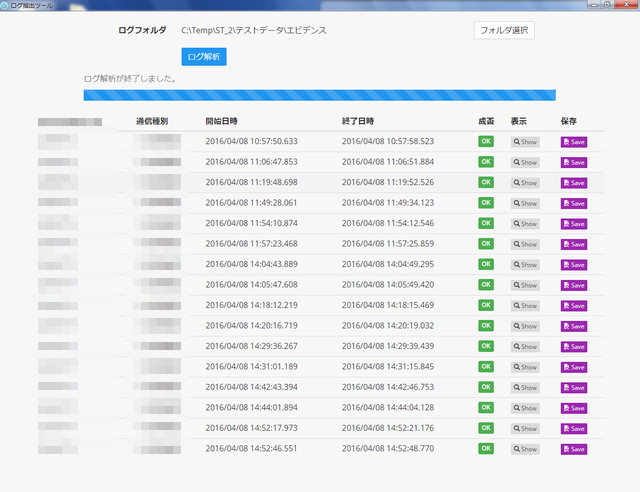
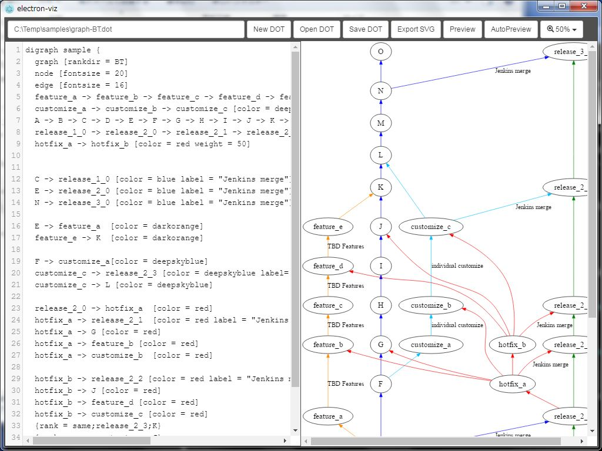

# Electron事始め

K1342 木村 憲規

---

## Electronとは？

* [Electron](http://electron.atom.io/)
  - Build cross platform desktop apps with web technologies

---

## Electronで作られたアプリ

---

## Electronでアプリ作ってみた (1)

Webアプリケーションのログを解析するツール

---

## ツールの構成

* 画面
  - *knockout.js* と *Bootstrap3*
* ロジック
  - *co*
  - *glob*
  - *fs-extra-promise*

---

## Electronでアプリ作ってみた (2)

*electron-viz* : Graphvizのエディタ/ビューア

https://github.com/Kazunori-Kimura/electron-viz

---

## ツールの構成

* 画面
  - *jQuery* と *Bootstrap3*
* ロジック
  - *viz.js*
  - *CodeMirror*

---

## 良さ

* まさしく *desktop apps with web technologies*
  - コード書いてて楽しい！
* javascript/node.jsの資産がそのまま使える

---

## つらさ

* 画面側の処理とバックエンドの処理が混じりそう
  - スパゲッティ不可避（かも）
* Windows向けにビルドすると dllファイル多数
  - Mac向けだと .app にまとめられるけど、ファイルサイズは大きい

---

## JavaScript研究会

* 近日開催予定！
  - Electronも取り上げたい

---

## ありがとうございました！

http://kazunori-kimura.github.io/

* Twitter: @KazunoriJs
* Facebook: facebook.com/kazunori.kimura.311
* GitHub: https://github.com/Kazunori-Kimura
* Qiita: http://qiita.com/Kazunori-Kimura
