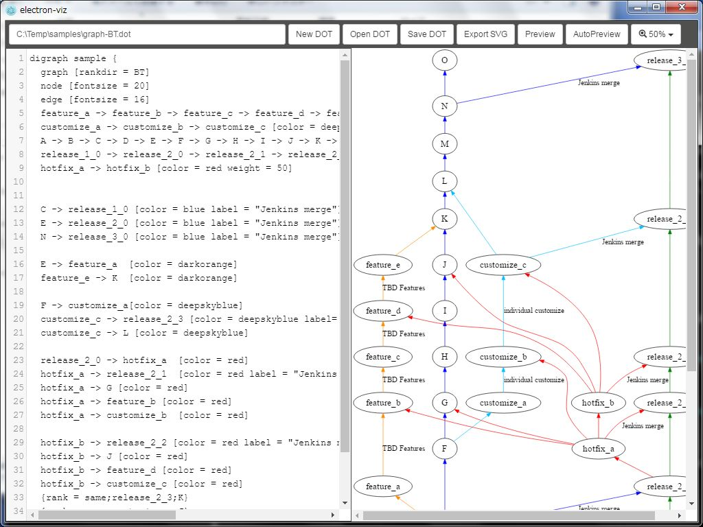

# Graphvizの紹介とelectron-viz

K1342 木村 憲規

---

## Graphviz

> Graphviz（Graph Visualization Software）は AT&T研究所が開発したオープンソースのツールパッケージであり、DOT言語のスクリプトで示されたグラフを描画する。パッケージにはアプリケーションソフトウェアからツールを使うためのライブラリも含まれる。Graphviz は Eclipse Public License ライセンスで提供されるフリーソフトウェアである。  
> [Graphviz | Wikipedia](https://ja.wikipedia.org/wiki/Graphviz)

http://www.graphviz.org/

---

## 何が出来るの？

様々なグラフが書けます

* 「chart」でなく「graph」
  - フローチャートや家系図など

---

### 例 (sample.dot)

```
digraph graphname {
  a -> b -> c;
  b -> d;
}
```

---

### 例 (sample.svg)

dotファイルを Graphviz で SVG に変換した例:


---

### SVGって？

> Scalable Vector Graphics（スケーラブル・ベクター・グラフィックス、SVG）は、XMLをベースとした、2次元ベクターイメージ用の画像形式の1つである。  
> [SVG | Wikipedia](https://ja.wikipedia.org/wiki/Scalable_Vector_Graphics)

---

## Graphvizの使い方

CLI (コマンドラインインターフェース) で操作します。

```sh
$ dot -Tsvg sample.dot -o sample.svg
```

---

### CLIだと不便

* dot書く -> CLIで変換 -> 結果確認
  - リアルタイムプレビューが欲しい

---

## electron-viz

https://github.com/Kazunori-Kimura/electron-viz



---

## ありがとうございました！

http://kazunori-kimura.github.io/

* Twitter: @KazunoriJs
* Facebook: facebook.com/kazunori.kimura.311
* GitHub: https://github.com/Kazunori-Kimura
* Qiita: http://qiita.com/Kazunori-Kimura
