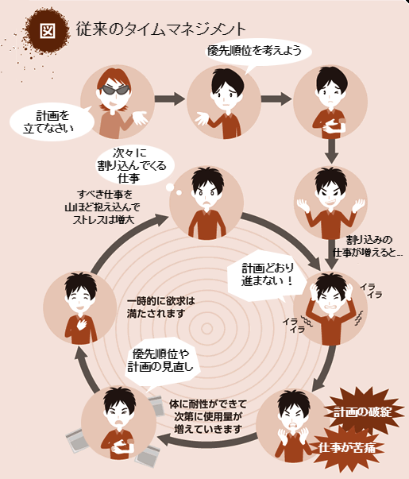
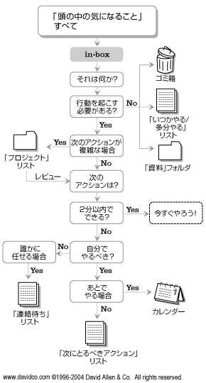

# GTDでストレスフリーな生活を

K1342 木村 憲規

---

## 目次

1. GTDとは
2. ストレスフリーの理由
3. 具体的な実践

---

## 1. GTDとは

* Getting Things Done の略
* ナレッジワーカーの仕事術
* デビッド・アレン さんが提唱
* 心理的な負担を減らしながら個人の生産性を上げる

---

### デビッド・アレンさん近影

---

### デビッド・アレン社

* 生産性向上技術、行動管理、役員コーチングを扱っている
* 定期的にセミナーを開催
  - 受講者1人につき595ドル
  - 多人数向けの会社研修会で1回 20,000ドル

---

閑話休題

---

## 5つのステップ

1. *収集* : *頭の中の気になることすべて* を紙などに書き出す
2. *処理* ： 書き出した内容を *手順に添って* 分類しリスト化する
3. *整理* ： スケジュール管理に使っているツールに入れ込む
4. *見直し* ： 自分の状況や状態でそれらが可能かどうか見直し、検討する。
5. *実行* ： リストアップした「出来ること」を順次片付ける。

---

## 2. ストレスフリーの理由

---

## GTDだと...

* 頭の中のモヤモヤした物を全て吐き出す
  - 公私の区別なくすべて書き出す
  - 気になっていること、やらないといけない作業、やりたい事...

頭の中は *すべき仕事全部を覚えなくてもよくなり* 、すっきりとし
リストに基づき *実際の仕事をこなすことに集中* できる

---

## 3. 具体的な実践

* 重要なのは *収集* と *処理*

---

## 収集

* ノートやチラシの裏などにタスクを書き出す
  - 最初は2時間以上かけて絞り出す
  - 毎週やると、30分くらいで終わる

---

## 処理

http://www.itmedia.co.jp/bizid/articles/0606/28/news097_3.html

---

### *処理* のポイント

* 優先順位はあまり考えない
* すぐにできるようなものならばすぐ済ませる
  - 目安は2分

---

## おすすめのやり方 (1)

* 休みの日に *収集* をやる
  - 頭がシクシクするまで絞りだす
  - 誰にも邪魔されない環境が良い (喫茶店とか)
* その後に *処理* を行う
  - 簡単なタスクはその場で片付ける

---

## おすすめのやり方 (2)

* *整理* は Outlook や iPhone のToDoアプリに突っ込む
  - ツールを分散させない事が重要
  - 優先順位は付けないが、重要かどうかは判断
* *見直し* は週一回
  - 途中の割り込み作業はノートに記録
  - 簡単なタスクでなければ、すぐに手を付けない

---

## おすすめのやり方 (3)

* 平日にタスクを *実行*
  - 重たいタスク、気が乗らないタスクは後回し

---

## 参考

* ITmedia: Getting Things Done (GTD) まとめ
  - http://www.itmedia.co.jp/bizid/gtd_index.html
