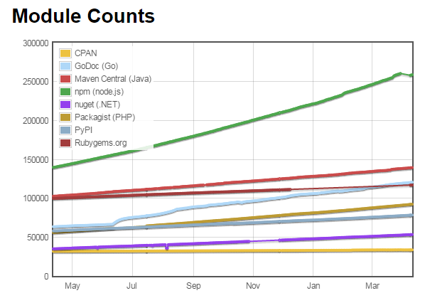

# Node.jsのススメ

K1342 木村 憲規

---

## Node.jsとは？

* [nodejs.org](https://nodejs.org/en/)
  - `event-driven`
  - `non-blocking I/O model`

---

## C10K問題

* Apacheなどで採用されているマルチスレッドモデルの難点
  - スレッド毎のメモリ領域の圧迫
  - ロック制御など処理の複雑化
  - I/O待ち

---

## Node.jsは

* `event-driven` と `non-blocking I/O model` でサーバーリソースの効率的使用とI/O待ちの低減を実現

---

## そんなことより

* JavaScriptがブラウザから解放される

---

## どのバージョンを使えばよい？

* メジャーバージョンが偶数のやつが *LTS* (Long Term Support)
  - 2016/04/27 に v6.0.0 リリース
  - お仕事で使用するなら v4.4.3 -> 2018/04/01 までサポート
  - 2016/10/01 から v6 が *LTS* -> 2019/04/01 までサポート

---

## 導入方法

ごりごりバージョンが上がっていくので、バージョン管理ツールの使用をおすすめ

* Windows: [nodist](https://github.com/marcelklehr/nodist)
* Mac: [nodebrew](https://github.com/hokaccha/nodebrew)

---

## npm

* Node Package Manager
* 他言語と比べてダントツのパッケージ数



> http://www.modulecounts.com/

---

## コマンドラインツールの導入/作成も簡単

* 拙作 `node-gi` (コマンドラインで .gitignore を作成) をインストールする

```sh
> npm install -g node-gi
```

---

## フロントエンド開発では不可欠

* gulp, grunt
* babel, TypeScript
* SASS, SCSS
* minify
* WebPack, browserify

---

## 様々なツール

* *Apache Cordova* : HTMLとJavaScriptでスマフォアプリ開発
* *Electron* : HTMLとJavaScriptでデスクトップアプリ開発

---

## NodeSchool

* Node.jsについて勉強するNode.jsのツール
  - [NodeSchool](http://nodeschool.io/ja/index.html)

---

## まとめ

* C10K問題の解決
* Webアプリ開発では不可避になりつつある
* 使い慣れたJavaScriptで様々なアプリを開発可能

---

## JavaScript研究会

* 近日開催予定！
  - 初回は Node.js のセットアップと NodeSchool を予定

---

## ありがとうございました！

http://kazunori-kimura.github.io/

* Twitter: @KazunoriJs
* Facebook: facebook.com/kazunori.kimura.311
* GitHub: https://github.com/Kazunori-Kimura
* Qiita: http://qiita.com/Kazunori-Kimura
